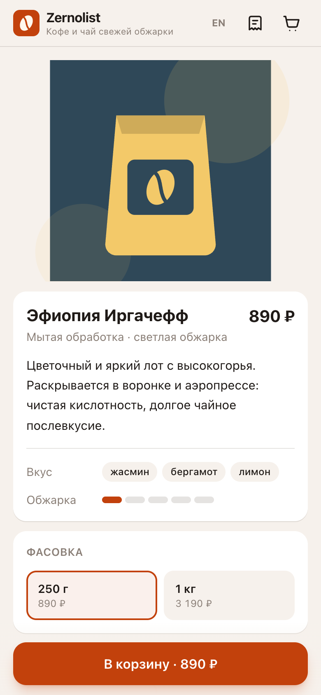
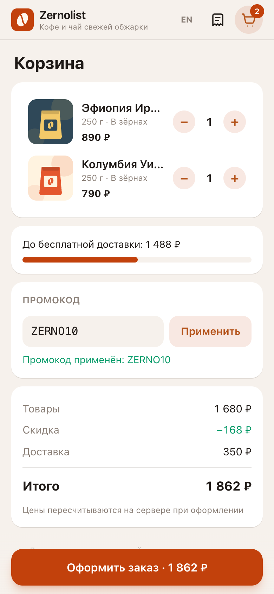
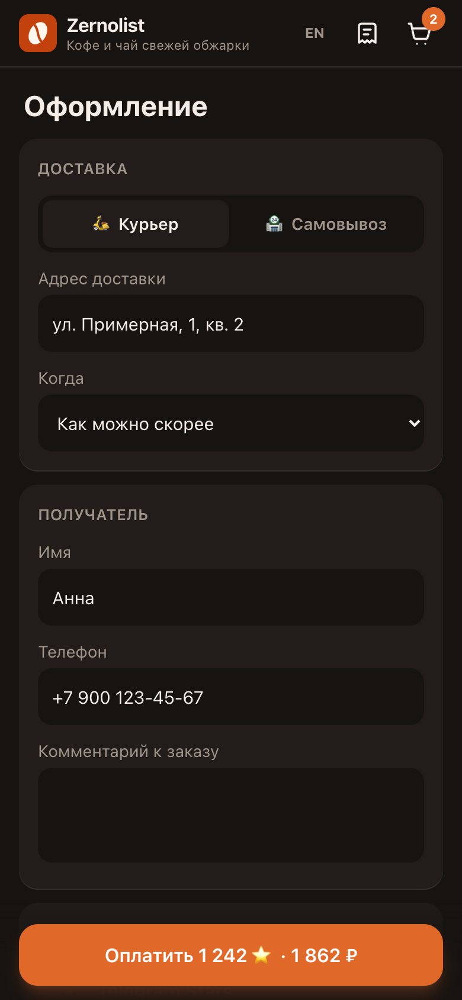
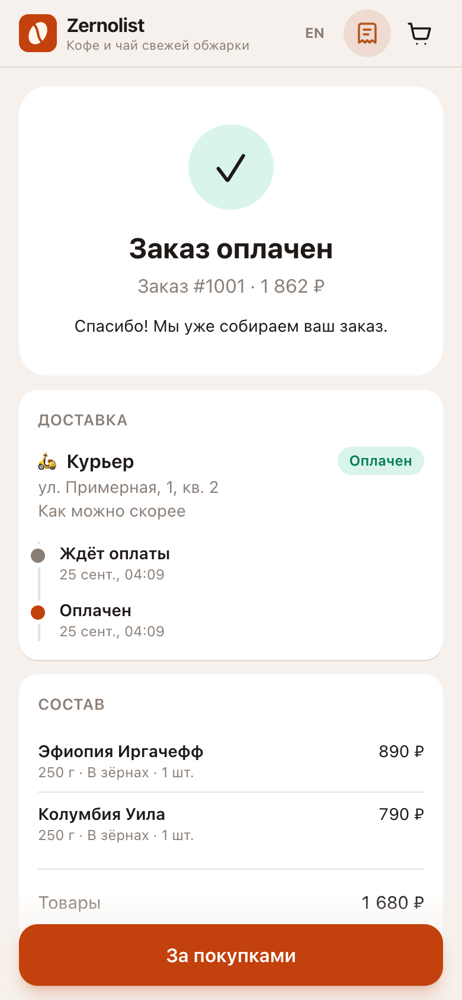

# Zernolist — Telegram Mini App shop

[](https://github.com/sinnercode228/tg-shop-miniapp/actions/workflows/ci.yml)
[](https://sinnercode228.github.io/tg-shop-miniapp/)

**Live demo:** https://sinnercode228.github.io/tg-shop-miniapp/ (работает в браузере без бэкенда / runs in the browser, no backend)

> **Демо-проект / Demo project.** «Zernolist» — вымышленный магазин кофе и чая. Товары, цены и заказы ненастоящие; оплата в демо имитируется.
> Zernolist is a fictional coffee & tea shop. Products, prices and orders are not real; payment is simulated in the demo.

<p>
  
  
  
  
  
  
</p>

[Русский](#русский) · [English](#english)

---

## Русский

Полноценный магазин внутри Telegram: Mini App на React и бот на aiogram 3 с REST API, заказами в SQLite и оплатой в Telegram Stars.

### Возможности

**Mini App (`/webapp`)** — React 19 + Vite + TypeScript + Tailwind CSS 4
- Каталог с поиском (RU/EN, без учёта регистра и «ё») и категориями, карточка товара с фасовкой, помолом и количеством.
- Корзина (zustand, сохраняется в localStorage), промокоды, прогресс до бесплатной доставки.
- Оформление: курьер или самовывоз, время доставки, контакты, оплата Stars или при получении; итог считает сервер.
- Экран подтверждения и история заказов с таймлайном статусов.
- Telegram WebApp SDK: `themeParams` → CSS-переменные (тема клиента), нативные `MainButton` / `BackButton`, haptic feedback, `openInvoice` для Stars.
- Вне Telegram — браузерный фолбэк: собственная нижняя кнопка, демо-окно оплаты Stars, светлая/тёмная тема, RU/EN.
- Слой данных за интерфейсом `ShopApi`: `MockShopApi` (в браузере, для GitHub Pages) или `HttpShopApi` (FastAPI). Переключение — `VITE_API_MODE=mock|http`.

**Бот и API (`/bot`)** — Python 3.12+, aiogram 3, FastAPI, SQLAlchemy 2 (async) + aiosqlite
- `/start` с кнопкой открытия Mini App (и кнопка меню), `/myorders`, `/help`, `/paysupport`.
- Проверка `initData` по HMAC-SHA256 (алгоритм из документации Telegram) + TTL и защита от подмены; REST-авторизация `Authorization: tma <initData>`.
- Заказы в SQLite (легко заменить на PostgreSQL: extra `postgres`), история статусов, машина состояний переходов.
- Уведомления админам о новых заказах с inline-кнопками; команды `/orders`, `/order <id>`, `/status <id> <статус>`, `/refund <id>`, `/admin`.
- Модуль платежей Telegram Stars (XTR): инвойс-ссылки, `pre_checkout_query`, `successful_payment`, возврат через `refundStarPayment`.
- Приём заказов через `web_app_data` (запуск с reply-клавиатуры).
- FastAPI: `GET /api/catalog`, `POST /api/quote`, `POST/GET /api/orders`, `GET /api/orders/{id}`, `POST /api/orders/{id}/invoice`, OpenAPI на `/api/docs`.

**Общие данные (`/shared`)** — `catalog.json`, `pricing.json` и контрактные тест-векторы `pricing-cases.json`: одна и та же логика цен на Python и TypeScript проверяется одинаковыми кейсами. Деньги — целые копейки, никаких float.

### Архитектура

```
webapp/  React UI ─► ShopApi ─┬─ MockShopApi (localStorage, GitHub Pages)
                              └─ HttpShopApi ──► FastAPI ─► OrderService ─► SQLAlchemy/SQLite
bot/     aiogram 3 ─────────────────────────────────────────┘        │
                         Telegram Stars ◄── payments/stars.py ◄──────┘  Notifier → админы
shared/  catalog.json · pricing.json · pricing-cases.json (контракт Python ⇄ TS)
```

### Запуск

```bash
# Mini App (демо-режим, без бэкенда)
cd webapp
npm ci
npm run dev             # http://localhost:5173
npm test                # vitest
npm run lint && npm run build

# Бот + API
cd bot
python3 -m venv .venv && source .venv/bin/activate
pip install -e ".[dev]"
cp .env.example .env    # BOT_TOKEN от @BotFather, ADMIN_IDS, WEBAPP_URL
python -m tgshop --mode all      # бот (long polling) + API :8080; режимы: bot | api
pytest && ruff check . && mypy

# Mini App с реальным API
cd webapp && VITE_API_MODE=http npm run dev   # /api проксируется на :8080
```

**Docker:** `cp bot/.env.example bot/.env && docker compose up --build` — API на `:8080`, Mini App (nginx, `/api` проксируется) на `:8081`. Telegram открывает Mini App только по HTTPS — используйте туннель или обратный прокси и укажите URL в `WEBAPP_URL`.

**Промокоды в демо:** `ZERNO10` (−10 %, максимум 1000 ₽), `FREEDELIVERY`.

### Тесты и CI
- pytest — 107 тестов: initData (подпись, TTL, подделка), расчёт цен и контрактные векторы, статусы, сервис заказов, API, хендлеры бота и Stars. Покрытие ~85 %.
- vitest — 36 тестов: корзина, контракт цен, поиск, форматирование денег, демо-API, сквозной сценарий оформления заказа в UI.
- `.github/workflows/ci.yml` — ruff, mypy (strict), pytest; eslint, prettier, vitest, сборка.
- `.github/workflows/pages.yml` — сборка демо и деплой на GitHub Pages (Settings → Pages → Source: **GitHub Actions**).

---

## English

A complete shop inside Telegram: a React Mini App plus an aiogram 3 bot with a REST API, SQLite orders and Telegram Stars payments.

### Features

**Mini App (`/webapp`)** — React 19 + Vite + TypeScript + Tailwind CSS 4
- Catalog with search (RU/EN, case- and "ё"-insensitive) and categories; product page with size, grind and quantity.
- Persistent cart (zustand + localStorage), promo codes, free-delivery progress bar.
- Checkout: courier or pickup, delivery slot, contacts, Stars or pay-on-receipt; the total comes from the server.
- Confirmation screen and order history with a status timeline.
- Telegram WebApp SDK: `themeParams` mapped to CSS variables, native `MainButton` / `BackButton`, haptics, `openInvoice` for Stars.
- Browser fallback outside Telegram: in-page main button, demo Stars sheet, light/dark theme, RU/EN.
- Data layer behind a `ShopApi` interface: `MockShopApi` (in-browser, used on GitHub Pages) or `HttpShopApi` (FastAPI), switched with `VITE_API_MODE=mock|http`.

**Bot & API (`/bot`)** — Python 3.12+, aiogram 3, FastAPI, async SQLAlchemy 2 + aiosqlite
- `/start` with a Mini App button (plus menu button), `/myorders`, `/help`, `/paysupport`.
- `initData` HMAC-SHA256 validation per Telegram docs with TTL; REST auth via `Authorization: tma <initData>`.
- Orders in SQLite (PostgreSQL via the `postgres` extra), status history and a transition state machine.
- Admin notifications with inline actions; `/orders`, `/order <id>`, `/status <id> <status>`, `/refund <id>`, `/admin`.
- Telegram Stars (XTR) module: invoice links, `pre_checkout_query`, `successful_payment`, refunds via `refundStarPayment`.
- Orders via `web_app_data` (keyboard-button launch).
- FastAPI endpoints: catalog, quote, orders, invoice; OpenAPI at `/api/docs`.

**Shared data (`/shared`)** — the catalog, pricing rules and contract test vectors used by both pytest and vitest, so Python and TypeScript pricing can never drift. Money is integer kopecks.

### Run

See the commands in the Russian section above: `npm ci && npm run dev` for the demo, `pip install -e ".[dev]" && python -m tgshop` for the bot + API, `docker compose up --build` for the full stack.

### Tests & CI
- pytest: 107 tests (initData, pricing + contract vectors, status machine, order flow, API, bot handlers, Stars), ~85 % coverage.
- vitest: 36 tests (cart, pricing contract, search, money formatting, demo API, end-to-end checkout UI).
- CI: lint + type-check + tests + build; Pages workflow deploys the static demo with `actions/deploy-pages`.

---

Author: [sinnercode228](https://github.com/sinnercode228) · Telegram [@sinnercode](https://t.me/sinnercode) · MIT License
