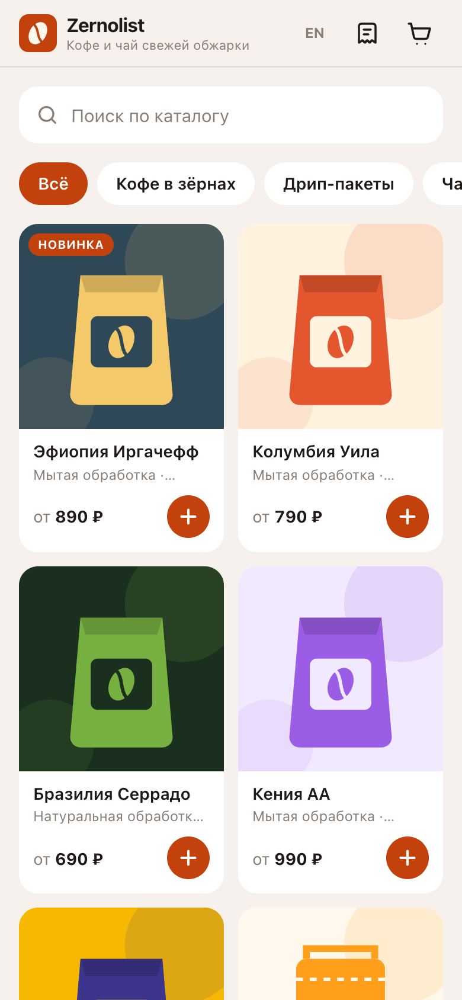
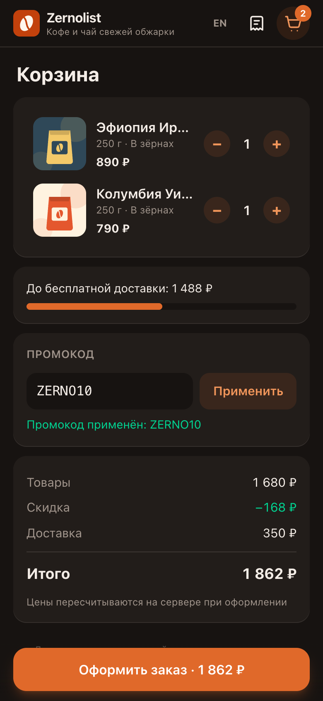
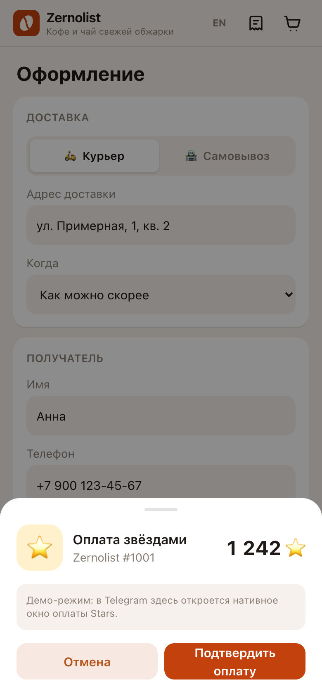

# Zernolist — магазин в Telegram Mini App

Магазин кофе и чая, который открывается прямо в Telegram. Покупатель ищет по каталогу, применяет промокод, выбирает курьера или самовывоз, платит звёздами (Stars) или при получении и потом следит за статусом заказа. Админу заказы приходят в бот, статус он меняет кнопками под уведомлением. Магазина «Zernolist» не существует, ассортимент и цены я сочинил.

Демо в обычном браузере: https://sinnercode228.github.io/tg-shop-miniapp/

<p>
  
  
  
</p>

В браузере нет главной кнопки Telegram, поэтому страница рисует свою (`FallbackMainButton`). Бэкенда у демо нет: данные отдаёт [`MockShopApi`](webapp/src/api/mock.ts), заказы лежат в `localStorage`, статусы сами двигаются через 30 секунд, 3 и 15 минут после оформления (у заказа со Stars — после оплаты). Вместо нативного окна оплаты Stars показывается имитация (`DemoInvoiceSheet`); оба компонента в [`Chrome.tsx`](webapp/src/components/Chrome.tsx). Скриншоты сняты в этом режиме, а не в клиенте Telegram.

## Деньги считаются в копейках

Все суммы я держу в целых копейках, от [`shared/pricing.json`](shared/pricing.json) до колонок в базе. Звёзды считаются от суммы заказа со скидкой и доставкой: одна звезда стоит 150 копеек (`kopecksPerStar`), округление вверх, в пользу магазина. В [`domain/pricing.py`](bot/tgshop/domain/pricing.py) это целочисленное деление `-(-amount // rules.kopecks_per_star)`, без float.

На скриншотах корзина на 1862 ₽ и окно оплаты на 1242 звезды: 186200 / 150 = 1241,33, округление вверх. Процентная скидка округляется вниз до целого рубля: `ZERNO10` на 1503,45 ₽ даёт 150 ₽, а не 150,35. Потолок у этого промокода 1000 ₽.

Цену из запроса сервер не использует. В схеме позиции корзины нет поля цены, а `OrderService._resolve` ([`services/orders.py`](bot/tgshop/services/orders.py)) берёт товар, вариант и цену из каталога:

> Resolve client items against the catalog. Client-side prices are never trusted.

Тест `test_client_supplied_prices_are_ignored` в [`test_api.py`](bot/tests/test_api.py) отправляет гайвань с `"price": 1` и `total: 1` и проверяет, что `subtotal` в заказе равен каталожным 129000 копеек (1290 ₽).

Та же логика есть на TypeScript в [`webapp/src/domain/pricing.ts`](webapp/src/domain/pricing.ts): по ней считаются корзина и демо-API, а экран оформления в режиме `http` берёт расчёт у сервера (`POST /api/quote`). Чтобы две реализации не разъехались незаметно, в [`shared/pricing-cases.json`](shared/pricing-cases.json) лежат 9 векторов: порог бесплатной доставки (он считается от суммы после скидки), потолок скидки, неизвестный промокод, пустая строка вместо промокода и т. д. Их прогоняют и pytest ([`test_pricing.py`](bot/tests/test_pricing.py)), и vitest ([`pricing.contract.test.ts`](webapp/src/domain/pricing.contract.test.ts)). В TS звёзды и скидка считаются через `Math.ceil`/`Math.floor` поверх обычного деления: эти цифры только для корзины и демо, сумму к оплате сервер считает целыми числами.

## Оплата: от `POST /api/orders` до `successful_payment`

1. Mini App отправляет `POST /api/orders` с заголовком `Authorization: tma <initData>` ([`api/deps.py`](bot/tgshop/api/deps.py)).
2. Сервер проверяет initData, заново считает цену и создаёт заказ в статусе `awaiting_payment` с зафиксированной суммой в звёздах (`stars_amount`).
3. В том же ответе приходит ссылка на счёт от `createInvoiceLink`: валюта `XTR`, payload `order:<id>` ([`payments/stars.py`](bot/tgshop/payments/stars.py)).
4. Mini App открывает её через `Telegram.WebApp.openInvoice` ([`api/http.ts`](webapp/src/api/http.ts)). Если окно закрыли, на странице заказа остаётся кнопка оплаты: пока заказ в `awaiting_payment`, она берёт новую ссылку через `POST /api/orders/{id}/invoice` ([`routes/orders.py`](bot/tgshop/api/routes/orders.py)).
5. Telegram присылает `pre_checkout_query`, на ответ у бота 10 секунд. `check_payment` сверяет валюту, что платит владелец заказа, что заказ всё ещё ждёт оплаты и что сумма совпадает со `stars_amount`.
6. Приходит `successful_payment`. `mark_paid` повторяет ту же проверку, сохраняет `telegram_payment_charge_id` (по нему потом делается возврат) и переводит заказ в `paid`. Только теперь админам уходит уведомление о новом заказе; заказы с оплатой при получении приходят к ним сразу.

Telegram может доставить один и тот же апдейт повторно. `mark_paid` сначала проверяет, не записан ли этот charge id в заказ, и если записан, сразу возвращает заказ. В `test_full_stars_payment_flow` ([`test_order_service.py`](bot/tests/test_order_service.py)) `mark_paid` вызывается второй раз с тем же charge id, и второго уведомления админам не уходит. Колонка `telegram_payment_charge_id` объявлена с `unique=True` ([`db/models.py`](bot/tgshop/db/models.py)), так что один платёж нельзя записать на два заказа.

Бывает, что покупатель оплатил, а заказ за это время отменили. Тогда проверка в `mark_paid` не проходит, и сервис сам вызывает `refundStarPayment`, не дожидаясь поддержки. Бот пишет покупателю, что звёзды вернулись. Этот сценарий проверяет `test_payment_for_cancelled_order_is_refunded_automatically`.

Статусы описаны явным графом в [`domain/status.py`](bot/tgshop/domain/status.py), всё остальное `ensure_transition` отклоняет. Схема по докстрингу модуля:

```text
awaiting_payment ──► paid ──► confirmed ──► in_delivery ──────► completed
      │                │          │    └──► ready_for_pickup ─► completed
      ▼                ▼          ▼
  cancelled        refunded   cancelled / refunded
new ──► confirmed …          (оплата при получении, шага оплаты нет)
```

Поверх графа `allowed_transitions` учитывает способ оплаты: оплаченный звёздами заказ нельзя просто отменить, только вернуть деньги (`refunded`); заказ с оплатой при получении вернуть нельзя; `paid` руками не ставится вообще, он приходит только из платёжного потока. Кнопки под уведомлением для админа строятся из `allowed_transitions` ([`keyboards.py`](bot/tgshop/bot/keyboards.py)), поэтому недопустимого действия среди них нет.

Каждый переход пишется в `order_events` со временем, из этих записей Mini App рисует ленту статусов. SQLite при чтении теряет `tzinfo`, поэтому все `datetime` в моделях идут через тип `UTCDateTime` ([`db/models.py`](bot/tgshop/db/models.py)): наружу он отдаёт UTC, а naive datetime в базу не пускает.

Роутер платежей я подключаю к диспетчеру первым ([`factory.py`](bot/tgshop/bot/factory.py)). Других хендлеров `pre_checkout_query` сейчас нет, и порядок страхует на случай, если такой хендлер появится в другом роутере и перехватит запрос.

Если бот заблокирован или сеть сбоит, [`TelegramNotifier`](bot/tgshop/bot/notifier.py) пишет `TelegramAPIError` в лог и дальше не пробрасывает. Заказ оформляется, только уведомление не доходит.

Не доделано: неоплаченный заказ висит в `awaiting_payment`, пока админ не отменит его руками (`/status <id> cancelled`). [`OrderRepository.get`](bot/tgshop/db/repository.py) с `for_update=True` вызывает `with_for_update()`, но для SQLite SQLAlchemy `FOR UPDATE` не генерирует, и строка заказа на время транзакции не блокируется. Ручной возврат (`/refund` или кнопка у админа) вызывает `refundStarPayment` внутри открытой транзакции (`OrderService.refund`), и если после ответа Telegram коммит упадёт, звёзды уже вернутся, а статус заказа останется прежним.

## Подпись initData и чужие заказы

[`security/init_data.py`](bot/tgshop/security/init_data.py) проверяет подпись по алгоритму из документации Telegram: секретный ключ — HMAC-SHA256 от токена бота с ключом `"WebAppData"`, затем HMAC от отсортированных пар `key=value` без `hash`, и результат сравнивается с присланным через `hmac.compare_digest`. Ещё initData отклоняется, если:

- она старше 24 часов (срок задаёт `INIT_DATA_TTL`, меньше 60 секунд настройка не примет);
- `auth_date` больше чем на 60 секунд в будущем (`auth_date_in_future`);
- в строке повторяется ключ (Telegram таких строк не формирует);
- в ней нет `user`: магазину нужен покупатель.

Тест `test_algorithm_matches_telegram_docs_step_by_step` в [`test_init_data.py`](bot/tests/test_init_data.py) считает ожидаемый хеш по шагам документации напрямую через `hmac` и `hashlib` и только потом сверяет с ним `compute_hash`. Соседний тест фиксирует, что поле `signature` из Bot API 8.0 входит в строку проверки: исключается только `hash`. Саму Ed25519-подпись код не проверяет, только HMAC.

Чужой заказ по id не отдаётся, и ответ на него такой же, как на несуществующий: 404 `not_found`. Так `get_for_user` не даёт перебором id узнать, какие заказы существуют.

## Тема и кнопки Telegram

[`telegram/sdk.ts`](webapp/src/telegram/sdk.ts) переносит `themeParams` в CSS-переменные `--tg-*`, на них построены токены Tailwind; на `themeChanged` переменные перезаписываются. Вне Telegram их задаёт [`index.css`](webapp/src/index.css) с учётом `prefers-color-scheme`.

`useMainButton` из [`telegram/hooks.ts`](webapp/src/telegram/hooks.ts) в Telegram управляет нативной `MainButton`, а в браузере кладёт то же состояние в zustand-стор, откуда его рисует `FallbackMainButton`; `useBackButton` показывает `BackButton`, пока экран смонтирован. Вибрация в Telegram идёт через `HapticFeedback` (WebApp 6.1+), в браузере `navigator.vibrate` вызывается только после реального жеста (`navigator.userActivation.hasBeenActive`).

## Поднять у себя

Mini App в [`webapp/`](webapp) написан на React 19, Vite, TypeScript, Tailwind CSS 4 и zustand. В [`bot/`](bot) aiogram 3 и FastAPI работают в одном процессе, база подключена через SQLAlchemy 2 (async) и aiosqlite. Каталог и правила цен лежат в [`shared/`](shared), их читают обе стороны. Каждая группа команд ниже запускается из корня репозитория.

```bash
# Демо без бэкенда, как на GitHub Pages
cd webapp && npm ci && npm run dev    # http://localhost:5173

# Бот + API
cd bot
python3 -m venv .venv && source .venv/bin/activate
pip install -e ".[dev]"
cp .env.example .env           # BOT_TOKEN от @BotFather, ADMIN_IDS, WEBAPP_URL
python -m tgshop --mode all    # long polling + API на :8080; есть --mode bot и --mode api

# Mini App поверх настоящего API (Vite проксирует /api на :8080)
cd webapp && VITE_API_MODE=http npm run dev
```

Остальные переменные (`DATABASE_URL`, `API_HOST`, `API_PORT`, `CORS_ORIGINS`, `INIT_DATA_TTL`, `STARS_ENABLED`, `LOG_LEVEL`) перечислены в [`bot/.env.example`](bot/.env.example). В режиме `http` в браузере работают каталог и расчёт цены (`/api/catalog`, `/api/quote`), а заказы требуют initData: без неё API отвечает 401, так что оформить заказ можно только из клиента Telegram.

Всё вместе в Docker: `cp bot/.env.example bot/.env`, вписать `BOT_TOKEN`, затем `docker compose up --build`. API слушает `:8080`, Mini App отдаёт nginx на `:8081` и проксирует `/api`. Telegram открывает Mini App только по HTTPS, поэтому для проверки в клиенте нужен туннель или обратный прокси, а его адрес указывается в `WEBAPP_URL`.

## 107 + 36 тестов

```bash
(cd bot && pytest --cov)       # 107 тестов, покрытие 85%
(cd webapp && npm test)        # 36 тестов, vitest
```

[CI](.github/workflows/ci.yml) гоняет оба набора вместе с ruff, mypy strict и eslint на Python 3.12 и 3.14 и Node 22.

pytest покрывает initData, цены и контрактные векторы, граф статусов, сервис заказов с фейковым платёжным шлюзом (`FakePayments`), HTTP API через httpx и хендлеры бота. Хендлеры проверяются без моков aiogram: настоящие `Update` проходят через настоящий `Dispatcher` с роутингом, фильтрами и DI, а вместо сети стоит `RecordingSession`, которая записывает каждый вызов Bot API ([`tests/test_bot.py`](bot/tests/test_bot.py)).

vitest: корзина, поиск, форматирование денег, демо-API, те же 9 векторов цен и три UI-сценария в jsdom поверх mock API. В Node 25 свой глобальный `localStorage` перекрывает jsdom-овский, поэтому [`src/test/setup.ts`](webapp/src/test/setup.ts) ставит вместо него in-memory хранилище.

---

MIT · [sinnercode228](https://github.com/sinnercode228) · Telegram [@sinnercode](https://t.me/sinnercode)
