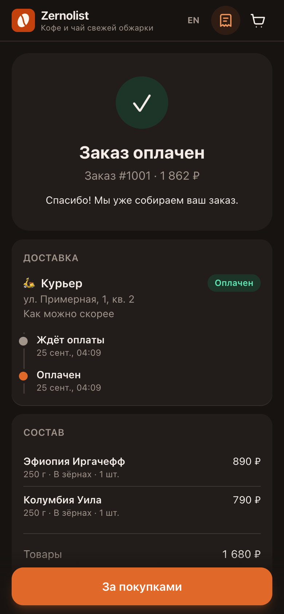

# Zernolist — магазин в Telegram Mini App

[English](README.md) · **Русский**

<p>
  
  
  
  
</p>

Магазин кофе и чая, который открывается прямо в Telegram: Mini App на React, бот на aiogram 3 и API на FastAPI в одном Python-процессе, заказы в SQLite, оплата звёздами (Stars) или при получении. Админу заказы приходят в бот, статус он меняет кнопками под уведомлением. Магазина Zernolist не существует: ассортимент, цены и точки самовывоза я сочинил, и заказчика у этого магазина нет.

Демо в обычном браузере: https://sinnercode228.github.io/tg-shop-miniapp/. Бэкенда у него нет: [`MockShopApi`](webapp/src/api/mock.ts) применяет в браузере те же правила цен и статусов, хранит заказы в `localStorage` и двигает их через 30 секунд, 3 и 15 минут после оформления (у заказа со Stars — после оплаты). В браузере нет главной кнопки Telegram и окна оплаты Stars, поэтому страница рисует `FallbackMainButton` и `DemoInvoiceSheet` ([`Chrome.tsx`](webapp/src/components/Chrome.tsx)). Скриншоты сняты в этом режиме, а не в клиенте Telegram. Внутри Telegram [`telegram/sdk.ts`](webapp/src/telegram/sdk.ts) переносит `themeParams` в CSS-переменные `--tg-*`, на которых построены токены Tailwind, и перезаписывает их на `themeChanged`.

## Чему сервер не верит

Позиции корзины клиент присылает как `productId`, `variantId`, `grind` и `quantity` ([`domain/schemas.py`](bot/tgshop/domain/schemas.py)). Поля цены нет, лишние поля отбрасываются. `OrderService._resolve` ([`services/orders.py`](bot/tgshop/services/orders.py)) берёт товар, вариант и цену из [`shared/catalog.json`](shared/catalog.json) и склеивает дубли. Тест `test_client_supplied_prices_are_ignored` ([`test_api.py`](bot/tests/test_api.py)) отправляет гайвань с `"price": 1` и `total: 1` и проверяет, что `subtotal` заказа равен каталожным 129000 копеек.

Деньги — целые копейки, от [`shared/pricing.json`](shared/pricing.json) до колонок в базе. В [`domain/pricing.py`](bot/tgshop/domain/pricing.py):

- процентная скидка округляется вниз до целого рубля: `ZERNO10` на 1503,45 ₽ даёт 150 ₽, а не 150,345; потолок у промокода 1000 ₽;
- курьер стоит 350 ₽, бесплатно от 3000 ₽ после скидки или с `FREEDELIVERY`;
- одна звезда — 150 копеек, округление вверх без float: `-(-amount // rules.kopecks_per_star)`. На скриншотах корзина на 1862 ₽ и окно оплаты на 1242 звезды: 186200 / 150 = 1241,33, округление вверх;
- неизвестный промокод в `POST /api/quote` — это `promoError`, а в `POST /api/orders` — 422 `unknown_promo`.

[`webapp/src/domain/pricing.ts`](webapp/src/domain/pricing.ts) повторяет эти правила для корзины и демо-API; в режиме `http` экран оформления показывает расчёт сервера из `POST /api/quote`. 9 векторов из [`shared/pricing-cases.json`](shared/pricing-cases.json) прогоняют и pytest ([`test_pricing.py`](bot/tests/test_pricing.py)), и vitest ([`pricing.contract.test.ts`](webapp/src/domain/pricing.contract.test.ts)), так что обе реализации проверяются на одних и тех же ожидаемых числах.

Эндпоинты заказов требуют `Authorization: tma <initData>` ([`api/deps.py`](bot/tgshop/api/deps.py)); `/api/catalog`, `/api/quote` и `/api/health` открыты. [`security/init_data.py`](bot/tgshop/security/init_data.py) повторяет алгоритм из документации Telegram: `secret = HMAC_SHA256("WebAppData", bot_token)`, затем HMAC от отсортированных пар `key=value` без `hash`, сравнение через `hmac.compare_digest`. Ещё initData отклоняется, если:

- ключ в строке повторяется (проверяется до подписи);
- `auth_date` больше чем на 60 секунд в будущем или старше `INIT_DATA_TTL` (по умолчанию сутки, меньше 60 секунд настройка не примет);
- `user` нет или он битый, даже при верной подписи.

Тест `test_algorithm_matches_telegram_docs_step_by_step` ([`test_init_data.py`](bot/tests/test_init_data.py)) считает хеш по шагам документации напрямую через `hmac` и `hashlib` и только потом сверяет с ним `compute_hash`. Поле `signature` из Bot API 8.0 остаётся в строке проверки, исключается только `hash`. Саму Ed25519-подпись код не проверяет, только HMAC.

Чужой заказ отдаёт такой же 404 `not_found`, как несуществующий (`get_for_user`), так что перебором id не узнать, какие заказы есть.

## Оплата Stars по шагам

1. `POST /api/orders` с `paymentMethod: "stars"` создаёт заказ в `awaiting_payment` с зафиксированным `stars_amount`, вызывает `createInvoiceLink` (валюта `XTR`, payload `order:<id>`, provider token не нужен; [`payments/stars.py`](bot/tgshop/payments/stars.py)) и в том же ответе возвращает `invoiceUrl`.
2. Mini App открывает ссылку через `Telegram.WebApp.openInvoice` ([`api/http.ts`](webapp/src/api/http.ts)). Если окно закрыли, на странице заказа остаётся кнопка оплаты: пока заказ ждёт оплаты, она берёт новую ссылку через `POST /api/orders/{id}/invoice` ([`routes/orders.py`](bot/tgshop/api/routes/orders.py)).
3. Telegram присылает `pre_checkout_query`, на ответ у бота 10 секунд. `check_payment` сверяет payload, валюту, что платит владелец заказа, что заказ всё ещё ждёт оплаты и что сумма равна `stars_amount`.
4. На `successful_payment` `mark_paid` повторяет ту же проверку, сохраняет `telegram_payment_charge_id` (он нужен для возврата) и ставит `paid`. Админы узнают о Stars-заказе только сейчас; заказы с оплатой при получении приходят к ним сразу.
5. Повторный апдейт с charge id, который уже записан в заказ, ничего не делает. В `test_full_stars_payment_flow` ([`test_order_service.py`](bot/tests/test_order_service.py)) `mark_paid` вызывается дважды, а уведомление админам уходит одно.
6. Если заказ не может принять деньги (отменён, пока было открыто окно; сумма устарела), `mark_paid` сразу вызывает `refundStarPayment`, а бот объясняет покупателю, что случилось. Это проверяет `test_payment_for_cancelled_order_is_refunded_automatically`.
7. Возврат позже: `/refund <id>` или inline-кнопка у админа → `refundStarPayment` → `refunded`.

Роутер платежей я подключаю первым ([`bot/factory.py`](bot/tgshop/bot/factory.py)). Других хендлеров `pre_checkout_query` сейчас нет, и порядок страхует на случай, если такой появится в другом роутере и перехватит запрос. [`TelegramNotifier`](bot/tgshop/bot/notifier.py) пишет `TelegramAPIError` в лог и не пробрасывает, так что при заблокированном боте теряется уведомление, а не заказ.

Статусы описаны явным графом в [`domain/status.py`](bot/tgshop/domain/status.py), всё остальное `ensure_transition` отклоняет. Схема по докстрингу модуля:

```text
awaiting_payment ──► paid ──► confirmed ──► in_delivery ──────► completed
      │                │          │    └──► ready_for_pickup ─► completed
      ▼                ▼          ▼
  cancelled        refunded   cancelled / refunded
new ──► confirmed …          (оплата при получении, шага оплаты нет)
```

`allowed_transitions` учитывает способ оплаты: оплаченный звёздами заказ можно вернуть, но не отменить; заказ с оплатой при получении вернуть нельзя; `paid` руками не ставится. Из этих переходов строятся кнопки у админа ([`keyboards.py`](bot/tgshop/bot/keyboards.py)). Каждый переход пишется в `order_events`, из них Mini App рисует ленту статусов; SQLite при чтении теряет `tzinfo`, поэтому все `datetime` в моделях идут через тип `UTCDateTime` ([`db/models.py`](bot/tgshop/db/models.py)).

## Запуск

Mini App в [`webapp/`](webapp) написан на React 19, Vite, TypeScript, Tailwind CSS 4 и zustand. В [`bot/`](bot) aiogram 3 и FastAPI работают в одном процессе с SQLAlchemy 2 (async) и aiosqlite. Каталог и правила цен обе стороны читают из [`shared/`](shared). Каждый блок команд запускается из корня репозитория.

```bash
# Mini App на демо-данных, как на GitHub Pages (Node 22)
cd webapp && npm ci && npm run dev        # http://localhost:5173
```

```bash
# API (Python 3.12+)
cd bot
python3 -m venv .venv && source .venv/bin/activate
pip install -e ".[dev]"
cp .env.example .env
python -m tgshop --mode api               # :8080, OpenAPI на /api/docs
```

```bash
# Mini App поверх этого API; Vite проксирует /api на :8080
cd webapp && VITE_API_MODE=http npm run dev
```

`--mode api` работает с `.env` из примера без правок. `--mode all` (по умолчанию, бот и API) и `--mode bot` на старте выставляют боту команды и кнопку меню, поэтому им нужен настоящий `BOT_TOKEN` от @BotFather; с токеном-заглушкой они падают с `TelegramUnauthorizedError`. Id админов идут в `ADMIN_IDS`, остальные переменные перечислены в [`bot/.env.example`](bot/.env.example).

В браузере в режиме `http` работают `/api/catalog` и `/api/quote`, а заказы без initData получают 401, так что оформить заказ можно только из клиента Telegram. `WEBAPP_URL` по умолчанию указывает на демо на GitHub Pages, которое работает на демо-данных и к вашему API не обращается; укажите там HTTPS-адрес, где отдаётся сборка в режиме `http`.

Docker: `cp bot/.env.example bot/.env`, вписать `BOT_TOKEN`, затем `docker compose up --build`. API слушает `:8080`, nginx отдаёт Mini App (собранный с `VITE_API_MODE=http`) на `:8081` и проксирует `/api`. Telegram открывает Mini App только по HTTPS, поэтому перед `:8081` нужен туннель или обратный прокси, а его адрес — в `WEBAPP_URL`.

Проверки, те же, что в [CI](.github/workflows/ci.yml) (Python 3.12 и 3.14, Node 22):

```bash
(cd bot && pytest --cov && ruff check . && ruff format --check . && mypy)          # 107 тестов, покрытие 85 %
(cd webapp && npm run lint && npx prettier --check . && npm test && npm run build)  # 36 тестов vitest
```

[`tests/test_bot.py`](bot/tests/test_bot.py) проверяет хендлеры бота без моков aiogram: настоящие `Update` проходят через настоящий `Dispatcher` с роутингом, фильтрами и DI, а вместо сети стоит `RecordingSession`, которая записывает каждый вызов Bot API. vitest покрывает корзину, поиск, форматирование денег, демо-API, те же 9 векторов цен и три UI-сценария в jsdom.

## Известные ограничения

- Компенсирующий возврат за платёж, который заказ не может принять, — одна попытка ([`services/orders.py:283`](bot/tgshop/services/orders.py#L283)). Если `refundStarPayment` бросит `TelegramAPIError`, хендлер его не поймает ([`handlers/payments.py:39`](bot/tgshop/bot/handlers/payments.py#L39) ловит только `PaymentError`): звёзды остаются списанными, повторной попытки нет.
- Ручной возврат вызывает `refundStarPayment` внутри открытой транзакции ([`services/orders.py:304`](bot/tgshop/services/orders.py#L304)). Если коммит упадёт после ответа Telegram, звёзды уже вернутся, а статус заказа останется прежним.
- `with_for_update()` ([`db/repository.py:27`](bot/tgshop/db/repository.py#L27)) на SQLite превращается в обычный `SELECT`, так что `mark_paid` не блокирует строку заказа между проверкой и записью. `unique=True` у `telegram_payment_charge_id` ([`db/models.py:82`](bot/tgshop/db/models.py#L82)) только не даёт записать один платёж на два заказа. Extra `postgres` объявлен в [`pyproject.toml`](bot/pyproject.toml), но ни тесты, ни CI против Postgres не запускаются.
- Неоплаченный Stars-заказ висит в `awaiting_payment`, пока админ не отменит его командой `/status <id> cancelled` ([`handlers/admin.py:73`](bot/tgshop/bot/handlers/admin.py#L73)); срока жизни у него нет.
- После `openInvoice` страница заказа один раз делает reload ([`OrderPage.tsx:35`](webapp/src/pages/OrderPage.tsx#L35)). В режиме `http` статус станет `paid` только после того, как бот прочитает `successful_payment` по long polling, поэтому этот reload может ещё показать `awaiting_payment`. Опроса нет.
- `openInvoice` может вернуть `pending`; [`CheckoutPage.tsx:134`](webapp/src/pages/CheckoutPage.tsx#L134) и [`OrderPage.tsx:33`](webapp/src/pages/OrderPage.tsx#L33) считают отменой всё, что не `paid`.
- Бот принимает заказы через `web_app_data` ([`handlers/webapp.py`](bot/tgshop/bot/handlers/webapp.py)), а `/start` присылает нужную для этого кнопку reply-клавиатуры ([`handlers/common.py:16`](bot/tgshop/bot/handlers/common.py#L16)), но Mini App нигде не вызывает `sendData`: в [`telegram/sdk.ts:69`](webapp/src/telegram/sdk.ts#L69) метод только объявлен.
- Слоты доставки подписаны по-разному: «9–12 / 18–21» в Mini App ([`i18n/index.ts:46`](webapp/src/i18n/index.ts#L46)), «10:00–14:00 / 18:00–22:00» в сообщениях бота ([`texts.py:25`](bot/tgshop/bot/texts.py#L25)). Задача [#1](https://github.com/sinnercode228/tg-shop-miniapp/issues/1).
- Схема создаётся через `create_all` на старте ([`db/session.py:34`](bot/tgshop/db/session.py#L34)), миграций нет.
- Тестами не покрыты [`bot/notifier.py`](bot/tgshop/bot/notifier.py), [`config.py`](bot/tgshop/config.py) и [`container.py`](bot/tgshop/container.py) (0 %); [`handlers/admin.py`](bot/tgshop/bot/handlers/admin.py) — 62 %.
- Демо-API сохраняет названия позиций и фасовку на русском ([`api/mock.ts:160`](webapp/src/api/mock.ts#L160)); в английском режиме список заказов ([`OrdersPage.tsx:68`](webapp/src/pages/OrdersPage.tsx#L68)) и фасовка на странице заказа ([`OrderPage.tsx:158`](webapp/src/pages/OrderPage.tsx#L158)) показывают их по-русски.
- Регулярка телефона написана трижды: [`domain/schemas.py:15`](bot/tgshop/domain/schemas.py#L15), [`api/mock.ts:22`](webapp/src/api/mock.ts#L22), [`pages/CheckoutPage.tsx:15`](webapp/src/pages/CheckoutPage.tsx#L15).

---

Автор — Грешный Котик (sinnercode), беру заказы на похожие задачи: Telegram [@sinnercode](https://t.me/sinnercode). Лицензия [MIT](LICENSE).
